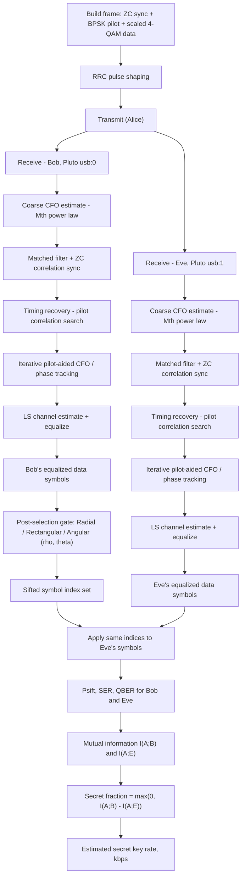

# Physical-Layer Secret Key Generation via Constellation Post-Selection

**An SDR testbed comparing Radial, Rectangular, and Angular symbol-gating strategies for a Bob/Eve 4-QAM link on ADALM-PLUTO hardware.**

> Experimental Investigation of Receiver Detection Techniques in SIM-QPSK Based Discrete-Modulated CV-QKD

## Table of Contents

- [Overview](#overview)
- [System Architecture](#system-architecture)
- [Post Selection Strategies](#post-selection-strategies)
- [Secrecy and Performance Metrics](#secrecy-and-performance-metrics)
- [Repository Structure](#repository-structure)
- [Requirements](#requirements)
- [Key Parameters](#key-parameters)
- [Getting Started](#getting-started)
- [Generated Outputs](#generated-outputs)
- [Future Work](#future-work)
- [License and Sharing Notes](#license-and-sharing-notes)
- [Acknowledgments](#acknowledgments)

## Overview

This repository implements and evaluates a **post-selection-based physical-layer secret key generation** scheme over a real over-the-air link using two ADALM-PLUTO software-defined radios.

A frame consisting of a Zadoff–Chu synchronization sequence, a BPSK pilot block, and an amplitude-reduced 4-QAM data payload is pulse-shaped with a root-raised-cosine (RRC) filter and transmitted. Two Pluto radios capture the **same** transmission at the same time — one representing the legitimate receiver **Bob**, one representing an eavesdropper **Eve** at a different location — and each independently runs a full synchronization, carrier-recovery, and equalization chain.

Rather than keeping every recovered data symbol, Bob applies a **gating (sifting) rule** in the constellation plane and keeps only his most confident detections. Because the accepted symbol *indices* (not their values) can be shared over a public channel, Eve's decoded values at those same indices can be compared against Bob's — letting the experiment quantify how much of an information advantage Bob gains over Eve purely from post-selection, using mutual information, sifted-symbol error rates, and an estimated secret key rate. This experimental design sits in the broader literature on physical-layer secret-key agreement (the Maurer / Ahlswede–Csiszár source model) and borrows its post-selection philosophy — and the QBER terminology — from discrete-modulation CV-QKD, while remaining a fully classical RF implementation.

Three gating geometries are compared throughout: **Radial**, **Rectangular**, and **Angular**.

## System Architecture

Two pipelines live in this repo:

- A **single-link diagnostic** pipeline (`Constellation_Visual_Testing.m`, optionally followed by `Unstable_Phase_Drift_Correction.m`) for tuning and sanity-checking the receiver chain with one Pluto and no Eve.
- A **two-receiver secrecy** pipeline (the `Comaparative_Analysis_*.m` scripts and `Rho_Theta_3D_Analysis.m`) that captures Bob and Eve simultaneously and sweeps the gating thresholds.

Both share the same frame structure and front-end recovery steps, shown below for the two-receiver case:

The expensive steps (SDR capture through equalization) run **once** per script execution, since `receiverDSP()` is called a single time before any sweep begins. Everything from the post-selection gate onward is then swept in software — across up to 4,500 (ρ, θ) combinations in `Rho_Theta_3D_Analysis.m` — without a second over-the-air capture.

**Frame structure:**

| Segment | Length | Modulation | Purpose |
|---|---|---|---|
| Zadoff–Chu sync | `Nsync` = 1021 (prime, so any root `u` is valid — `u` = 41 is used) | Unit-modulus complex exponential | Frame detection via matched-filter cross-correlation |
| Pilot | `Npilot` = 7,500 in `Constellation_Visual_Testing.m` / `Rho_Theta_3D_Analysis.m`, 7,000 in the three comparative scripts | BPSK (Gray-coded) | Timing-phase search, iterative CFO/phase tracking, LS channel estimation |
| Data | `Ndata` = 50,000 | 4-QAM, scaled by `mod_depth` = 0.1 | Payload symbols subject to post-selection gating |

## Post Selection Strategies

Let ρ scale a base radius by the RMS symbol-error `sigma_B`, and let θ be an angular half-width. Bob's three gating rules:

| Strategy | Accept condition | Geometric idea |
|---|---|---|
| **Radial** | distance to nearest ideal point `< ρ·σ` | Keep points inside a circle of radius ρσ centered on the nearest constellation point |
| **Rectangular** | `abs(I error) < ρ·σ` and `abs(Q error) < ρ·σ` | Same idea, but with a square acceptance region instead of a circular one |
| **Angular** | `abs(phase error) < θ` and `magnitude > r_min` | Keep points whose phase is within ±θ of the ideal phase **and** far enough from the origin that the phase estimate is trustworthy |

Note that ρ plays a different geometric role for Angular than for the other two: for Radial/Rectangular, ρ bounds how far a point may be from its ideal location (a *maximum*), while for Angular it sets `r_min`, a *minimum* distance from the origin (low-amplitude points have unreliable phase, so they're excluded rather than points that are simply off-target). Both directions shrink the accepted set as the threshold tightens, so sifting probability still falls in both cases — just via different geometry.

Across the four comparative/3D scripts, the Angular detector's other free parameter is fixed differently depending on which axis is being swept:

- In `Comaparative_Analysis_RHO.m`: θ is held at a constant 9°, and ρ scales `r_min` directly.
- In `Comparative_Analysis_THETA.m`: `r_min` is held at a constant 1.5σ, and θ is re-parameterized as `deg2rad(700·σ·ρ)` so that sweeping the same ρ axis sweeps θ from roughly 0°–40°.
- In `Rho_Theta_3D_Analysis.m`: both are swept independently over a full 100×45 grid.

## Secrecy and Performance Metrics

| Metric (variable) | Meaning |
|---|---|
| P_sift (`Pacc_*`) | Fraction of the 50,000 data symbols that survive Bob's gate |
| SER (`ser_*_B`, `SER_eve_*`) | Symbol error rate on the sifted subset, for Bob and for Eve |
| QBER / BER (`QBER_*`, `BER_eve_*`) | Bit error rate on the sifted subset (2 bits/symbol for 4-QAM, via `de2bi`) |
| I(A;B), I(A;E) | Mutual information (bits/symbol) between Alice's transmitted symbols and Bob's/Eve's decoded symbols on the sifted subset, from the empirical joint distribution (`MutualInfo()`) |
| Secret Fraction | `max(0, I(A;B) - I(A;E))` — Bob's information advantage over Eve, in bits/symbol |
| ESKR (kbps) | `(fs/sps) × P_sift × Secret Fraction / 1000` — symbol-rate-scaled estimate of net secret-key throughput |

## Repository Structure

| File | Role |
|---|---|
| `Transmitter.m` | Generates the complete SIM-QPSK transmit frame by creating the Zadoff-Chu synchronization sequence, BPSK pilot symbols, and low-modulation-depth QPSK data symbols. The script performs Root Raised Cosine (RRC) pulse shaping, configures the ADALM-PLUTO SDR transmitter, and continuously transmits the frame over the RF channel. Run this script before starting the receiver-side experiments to ensure a stable, repeatable transmission with identical synchronization, pilot, and payload sequences. |
| `Constellation_Visual_Testing.m` | Single-link (no Eve) end-to-end chain: builds the frame, captures one over-the-air burst, runs sync/CFO/timing/channel-estimation/equalization, then visually compares Radial, Rectangular, and combined Angular+Radial decision regions, printing SER and QBER for each. Use this to sanity-check the receiver and tune parameters before running the two-radio experiments. |
| `Unstable_Phase_Drift_Correction.m` | Diagnostic add-on that runs **after** `Constellation_Visual_Testing.m` in the same workspace (it reuses `rxData`, `dataBits`, `Nsym`, `refConst`). Splits the payload into 10 chunks to reveal residual carrier-phase drift across the ~50k-symbol frame, discards the noisier first chunk, and removes a steady-state phase offset estimated from the rest. |
| `Comparative_Analysis_RHO.m` | Two-radio (Bob `usb:0` / Eve `usb:1`) capture. Defines the shared `receiverDSP()` front end and `MutualInfo()` helper, then sweeps the radial multiplier ρ over 0.05–5 (100 points) at fixed θ = 9°, comparing all three gating strategies on P_sift, SER, QBER, secret fraction, and ESKR. |
| `Comparative_Analysis_THETA.m` | Same capture and metrics pipeline, but re-parameterizes the angular threshold as a function of ρ so the same sweep axis effectively scans θ from ~0°–40° at a fixed `r_min` = 1.5σ, isolating the Angular detector's sensitivity to θ. |
| `Comparative_Analysis_RHO_THETA.m` | Runs the ρ-sweep and the θ-sweep above back-to-back **on a single Bob/Eve capture**, so both sets of results come from identical channel conditions without a second over-the-air run. |
| `Rho_Theta_3D_Analysis.m` | Same capture and metrics pipeline, but runs a full nested grid (100 ρ values × 45 θ values = 4,500 points) for the Angular detector, rendering `surf` plots of P_sift, QBER, ESKR, and secret fraction over the joint (ρ, θ) plane — used to locate a good operating point before fixing thresholds in the two single-parameter scripts above. |
| `Results` | Contains the representative figures, plots, and performance outputs generated from the experimental evaluation of all detector algorithms. This includes constellation diagrams, detector region visualizations, QBER, BER, Sifting Probability, Secret Fraction, Secret Key Rate (SKR), and 3D threshold optimization results. Browse this folder to quickly review the experimental outcomes without executing the MATLAB scripts. |

`receiverDSP()` and `MutualInfo()` are defined identically at the top of all four two-radio scripts; if you continue developing this, pulling them into their own `.m` files would remove the duplication.

## Requirements

**Hardware**
- 3× ADALM-PLUTO SDR for the one transmitter script & two-radio scripts (Bob on `usb:0`, Eve on `usb:1`), connected to the receiving machine over USB.
- A transmitter broadcasting the same ZC-sync + pilot + `mod_depth`-scaled 4-QAM frame at `fc` = 950 MHz. This transmitter script isn't among the six files here — add it to the repo (or link to where it lives) if the goal is a fully self-contained, reproducible pipeline.

**Software**
- MATLAB
- Communications Toolbox
- Signal Processing Toolbox
- Communications Toolbox Support Package for Analog Devices ADALM-PLUTO Radio

## Key Parameters

| Parameter | Value | Meaning |
|---|---|---|
| `mod_depth` | 0.1 | Amplitude scale applied to the unit-average-power 4-QAM data symbols |
| `fc` | 950 MHz | Carrier frequency |
| `fs` | 1 MHz | Baseband sample rate |
| `sps` | 12 | Samples per symbol |
| `M` | 4 | Modulation order (4-QAM) |
| `Ndata` | 50,000 | Data symbols per frame |
| `rolloff`, `span` | 0.35, 8 | RRC pulse-shaping filter parameters |
| `Nsync`, `u` | 1021, 41 | Zadoff–Chu sequence length and root index |
| `Npilot` | 7,000 or 7,500 | BPSK pilot length (see frame-structure table above) |
| `rhoVec` | 0.05 : 0.05 : 5 | Radial/rectangular gating sweep (100 points) |
| `thetaVec` | 1 : 1 : 45 | Angular gating sweep in degrees (45 points) |

## Getting Started

1. **Connect hardware.** For the single-link script, two Pluto is enough. For the four comparative/3D scripts, connect three Plutos (TX; RX:enumerated `usb:0` and `usb:1`) to the receiving machine, and have your transmitter broadcasting the matching frame.
2. **Explore the joint parameter space first.** Run `Rho_Theta_3D_Analysis.m` to see how the Angular detector's sifting probability, QBER, secret fraction, and ESKR vary over the full (ρ, θ) grid, and pick informed fixed values for whichever parameter you'll hold constant next.
3. **Run the focused sweeps.** Use `Comaparative_Analysis_RHO.m` and `Comparative_Analysis_THETA.m` (or `Comaparative_Analysis_RHO_THETA.m` to get both from one capture) with thresholds informed by step 2.
4. **Debug the receiver in isolation.** If the sync/CFO/equalization chain itself needs tuning, use `Constellation_Visual_Testing.m` on a single Pluto, optionally followed by `Unstable_Phase_Drift_Correction.m` if you see phase drift across the payload.

## Generated Outputs

- Correlation-peak plot for frame synchronization
- Raw and gated constellation scatter plots (Radial / Rectangular / Angular decision regions, Bob and Eve side by side)
- Sifting probability (P_sift) vs. ρ or θ, for all three strategies
- SER and QBER/BER vs. ρ or θ, for Bob and Eve overlaid
- Secret fraction and estimated secret key rate (ESKR) vs. ρ or θ
- 3D surfaces of P_sift, QBER, secret fraction, and ESKR over the joint (ρ, θ) grid

> Representative outputs from all experiments can be found in the Results folder, allowing the generated figures and performance metrics to be reviewed without running the MATLAB scripts.

## Future Work

- Adaptive or jointly-optimized (ρ, θ) selection instead of a fixed operating point chosen by eye from the 3D surfaces
- Extending beyond 4-QAM to higher-order constellations
- Modeling Eve at multiple distances/angles to study how the secrecy advantage degrades with proximity to Bob
- Full key reconciliation and privacy amplification downstream of the sifted bits, to report a realized (not just estimated) secret key rate

## License and Sharing Notes

This repository is intended for academic and research purposes.

## Author

**Rishiraj Mishra** 
Department of Electrical Engineering 
Indian Institute of Technology Jammu 
Research Internship (May–June 2026)

## Acknowledgments

This work was carried out under the supervision of Dr. Anshul Jaiswal, Department of Electronics & Communication Engineering, Indian Institute of Technology Roorkee.

## Troubleshooting

- Ensure that the transmitter and receiver use identical system parameters (carrier frequency, sampling rate, modulation depth, synchronization sequence, pilot length, etc.).
- Verify successful reception using `Constellation_Visual_Testing.m` before running the comparative analysis scripts.
- If a residual phase rotation is observed, increasing the pilot length may improve phase estimation.
- If only part of the constellation is distorted, use `Unstable_Phase_Drift_Correction.m` to inspect phase stability across the received frame.
- Poor frame synchronization or multiple large correlation peaks may indicate insufficient received signal quality or that a longer Zadoff-Chu synchronization sequence is required.
